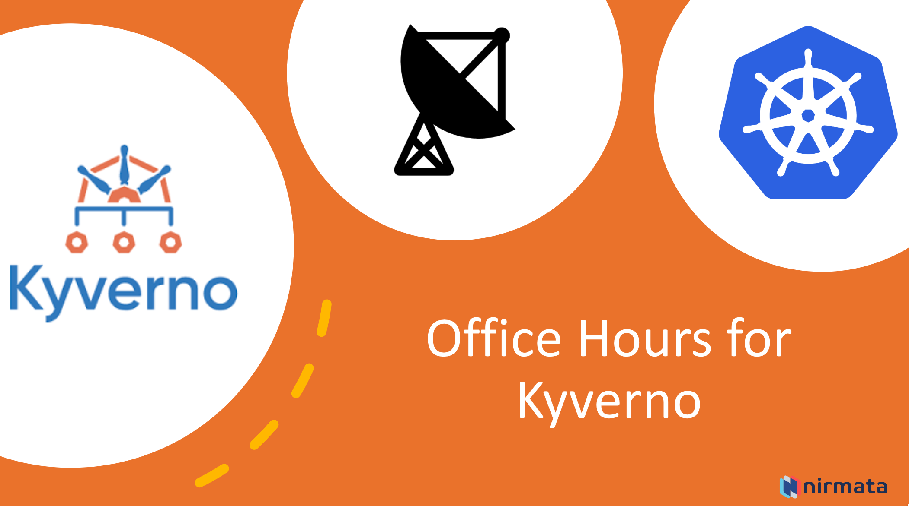

# Office Hours for Kyverno

This is a livestream hosted by the team at Nirmata, the creators of Kyverno, where we will discuss all things Kyverno and Kubernetes policy and governance!

Office hours occur on the second Thursday of every month at 10am EST / 7am PST. Join the Google group [here](https://groups.google.com/a/nirmata.com/g/kyverno-office-hours) to participate.

https://nirmata.zoom.us/j/83140582027?pwd=SG1xZ2RWR3VOZmhia0xyRnVLZkpmZz09

## Upcoming episodes

- Episode #1: [Testing policies with the Kyveno CLI]()
  - 8am PT, 11am ET, 4pm UK, 5pm Central Europe - Febuary 10th 2023
- Episode #2: Kyverno 1.9 features
  - 7am PT / 11am ET / 4pm UTC

## Add a topic

Please [open an issue](https://github.com/nirmata/office-hours-for-kyverno/issues/new) if you have suggestions for topics, speakers, or any other ideas.

## Previous episodes
